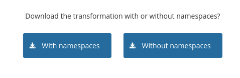

# Elexifier User Guide

Welcome to the *Elexifier User Guide*. Elexifier is an app that allows you to transform XML and PDF dictionaries into an *Elexis Data Model* compliant format. Note that the app is currently in a *Public Beta* release and it is likely that you will encounter bugs and/or unwanted behaviour. For assistance, don't hesitate to contact <elexifier@ijs.si>.

---
# Login
Elexifier is available on [elexifier.elex.is](elexifier.elex.is). You can create a user account or login with your *Sketch Engine* credentials. Once you have logged in, you will be able to choose the XML or the PDF transformation.
<!-- ADD MAYBE SCREENDUMP OPENING SCREEN -->

---

# Table of contents

<!-- vscode-markdown-toc -->
* 1. [XML transformation](#XMLtransformation)
	* 1.1. [Upload a new dictionary](#Uploadanewdictionary)
	* 1.2. [Transform the dictionary](#Transform_the_dictionary)
		* 1.2.1. [Adding core elements](#Addingcoreelements)
		* 1.2.2. [Editing core elements](#Editingcoreelements)
		* 1.2.3. [Examples](#Examples)
		* 1.2.3. [Best practices](#BestPractices)
	* 1.3. [Download transformed dictionary](#Downloadtransformeddictionary)
* 2. [PDF transformation](#PDFtransformation)
	* 2.1. [Sending dictionary to Lexonomy for annotation](#SendingdictionarytoLexonomyforannotation)
	* 2.2. [Annotating dictionary](#Annotatingdictionary)
	* 2.3. [Starting machine learning](#Startingmachinelearning)
	* 2.4. [Previewing results and downloading dictionary](#Previewingresultsanddownloadingdictionary)

<!-- vscode-markdown-toc-config
	numbering=true
	autoSave=true
	/vscode-markdown-toc-config -->
<!-- /vscode-markdown-toc -->

---

---

##  1. XML transformation
The XML transformation consists of three steps:
* 1.1. [Upload a new XML dictionary](#Uploadanewdictionary)
* 1.2. [Transform the dictionary](#Transform_the_dictionary)
* 1.3. [Download the transformed dictionary](#Downloadtransformeddictionary)

###  1.1. Add a new dictionary

<mark>You can upload a new dictionary or pull it from the Clarin.si repository.</mark>

<mark>If you choose to upload a dictionary,</mark> a pop-up window appears where you can:
1. Upload your dictionary.
<!-- LAYOUT check alignment of the text -->
You can drag the file you want to upload in the upload box with the dashed line or you can use the choose button to go to the correct folder on your computer and choose the file you want to upload.

>**Note**: Your file needs to be a **well-formed** XML file. Otherwise Elexifier will not be able to upload your dictionary.

2. Define its metadata. <!-- LINK TO OTHER PLACES ABOUT METADATA IN ELEXIS -->
3. Enter the basic parameters for the transformation:
- ENTRY ELEMENT: the XML element denoting entries (see Elexis Data Model)
- HEADWORD ELEMENT: the XML element denoting headwords (see Elexis Data Model)
- TRANSFORMATION NAME: select a name for your transformation

>**Note**: XPath (XML Path Language) is used for selecting the elements in your XML file. To learn about XPath, see e.g. this [XPath tutorial](https://www.w3schools.com/xml/xpath_intro.asp) or this [one](https://elexis.humanistika.org/resource/posts/xpath-for-dictionary-nerds), which is particularly targeted at dictionaries.
>**Note**: The ENTRY and HEADWORD parameters will be used for the initial segmentation of your dictionary. The current version of Elexifier does not support subsequent re-segmentation according to different values of the ENTRY and HEADWORD parameters. If you want to change the segmentation, create a new transformation.
<!-- term segmentation or transformation -->
<!-- ADD  AN EXPLANATION FOR THE OPTION CREATE FROM TRANSFORMATION -->

If your upload is successful, you will see the following screen, divided into three panes. 

<mark>If you choose to fetch a dictionary from Clarin.si, you need to enter the dictionary's unique URL handle in the following format: `http://hdl.handle.net/<id>/<id>`. You will be presented with the list of files available at this URL for you to choose from.</mark>

<mark>
The metadata is taken from the Clarin.si repository and you only need to define the dictionary's acronym which will be used to construct unique identifiers of individual elements. In the final step, you then need to defined the entry and headword elements and the transformation name as described above.
</mark>

<!-- ADD SCREENDUMP -->
Going from left to right, you see the XML dictionary/dictionaries in your account. By clicking on the three dots behind the ditionary file name, you can delete the dictionary or you can edit the metadata. In the next pane, you see the transformation(s) associated with the dictionary you are currently transforming and in the right pane you see a preview of your data. In the top row, four options are offered: you can download your transformed dictionary, you can edit the transformation or you can reset or remove your transformation.
<!-- ADD LINK  TO OTHER PLACES ABOUT EDITING METADATA -->
<!-- WHAT HAPPENS EXACTLY WHEN YOU RESET THE TRANSFORMATION = RESET TO UPLOAD VALUES? -->

---

###  1.2. Transform the dictionary
<!-- OR DO WE WANT TO HAVE A DEEPER NESTING HERE WITH THE FOLLOWING STUCTURE
- EDITING THE TRANSFORMATION
   - ADDING CORE ELEMENTS
   - EDITING CORE ELEMENTS
   - ADVANCED EDITING OPTIONS
   - EXAMPLES
   - BEST PRACTICES
- REMOVE TRANSFORMATION
-RESET TRANSFORMATION
-->
To transform your dictionary, click **Edit** in the top row. This will open the Edit Transformation screen.

The Edit Transformation screen consists of:
- The **list of entries** in your dictionary on the left hand side. 100 entries are displayed by default and you can search for additional entries using the search box.
- The **preview pane** showing the state of the dictionary *Before* (top-half) and *After* (bottom-half) transformation. You can use the **Strip namespaces** and **Strip dictScrap** checkboxes to make the preview of the transformed dictionary easier to read.
- The **Transformation editing pane** where you can further define your transformation. By default, the elements ENTRY, HEADWORD and SENSE are already selected. In the following subsections, we explain how you can add more core elements to your transformation and edit them.

---

####  1.2.1. Adding core elements

Click ADD CORE ELEMENT at the top of your screen and select a core element.

---

####  1.2.2. Editing core elements

To edit a core element you need to click on it and then you need to identify the corresponding XML element in your input data.

Elexifier helps you with the selection of XML elements by validating paths and providing suggestions. Start by selecting one of the XML elements from the list (you can type a few characters to filter the list) and then use the up and down keys to select one of the suggested sub-elements. Confirm selection by pressing the Enter key.

>**NOTE:** The elements search is case-sensitive.

Once you are happy with the information that you have entered, click **Update** in the top-right corner to update the transformation. For an example, see [here](#Asimpletransformation).

#### 1.2.3. Advanced editing options
Sometimes simply selecting the XML element or specifying the path is not enough. In those intances, you can use the following advanced editing options:
1. Optionally, use **EXCL.** to define the element which should not be included in the transformed dictionary. See [Exclude elements](#Excludeelements) for an example.
2. You can join elements to transform multiple XML elements in the input into one core element. See [Join elements](#Joinelements) for an example.
2. Select the value to be included in the transformed dictionary:
    - **Element inner text**: extract the inner text of the element
    - **Subtree text**: extract the inner text of the element and all of its descendants
    - **Attribute value**: extract the value of the selected attribute.
    See [Using attribute values in the transformed dictionary](#Usingattributevaluesinthetransformeddictionary) for an example.
    - **Constant**: return a constant value instead of extracting the value from the XML
<!-- ADD EXAMPLES FOR ALL THESE OPTIONS -->
3. Optionally, run regex expressions on the extracted values.
<!-- ADD EXAMPLE -->
4. Click **Update** to update the transformation.

---

####  1.2.4. Transformation Examples
This section contains example transformations that illustrate the various options offered by Elexifier.

---

##### 1.2.4.1. A simple transformation
<!-- headword may not be the best example, if headword is already set at upload of the dictionary -->
Let's transform a simple XML element `hw` into its Elexis Data Model representation:

    <hw>babble</hw>

Define the HEADWORD element as shown below and press **Update**:

The transformed dictionary looks like this:

    <form type="lemma">
        <orth m:e="hw">babble</orth>
      </form>

---

##### 1.2.4.2. Using attribute values in the transformed dictionary
Let's say we want to transform attribute values into Elexis Data Model elements.

    <Lemma writtenForm="X ray" partOfSpeech="n"/>

In the example above, the HEADWORD element can be found in the `writtenFrom` attribute. Start by defining the element containing the attribute to transform (in our case `Lemma`). Then select **Attribute value** in the VALUE field and enter the attribute name (in our case `writtenForm`).

The transformed dictionary looks like this:

    <form type="lemma">
        <orth>X ray</orth>
    </form>

---

##### 1.2.4.3. Exclude elements
Let's say we have a `tr` element that can denote a headword translation and an example translation. The transformation needs to take into account where the `tr` element appears in the original XML. We can achieve this by using the **EXCL.** option.

    <tr>žlobudranje; blebetanje, čvekanje, kvasanje; <ic>o otroku</ic>čebljanje;<ic>npr. o potoku</ic>žuborenje, šumenje</tr>
    <e>
      <le>the distant babble of women's voices</le>
      <tr>oddaljeno žensko žlobudranje</tr>
    </e>

If we were to use just the `tr` element in the HEADWORD TRANSLATION core element, the resulting dictionary would not be transformed correctly.

In the example below, the `e/tr` element, which denotes a translation of an example sentence, is also transformed into a headword translation.

    <cit type="translationEquivalent">
        <quote xml:lang="sl">žlobudranje; blebetanje, čvekanje, kvasanje; čebljanje; žuborenje, šumenje</quote>
    </cit>
    <cit type="example">
        <quote>the distant babble of women's voices</quote>
    </cit>
    <cit type="translationEquivalent">
        <quote>oddaljeno žensko žlobudranje</quote>
    </cit>

By defining the **EXCL.** parameter, we can prevent the `e/tr` element from being incorrectly transformed into HEADWORD TRANSLATION.

In the EXAMPLE TRANSLATION core element, we can then define the correct path for the example translation:

This results in the correct transformation:

    <cit type="translationEquivalent">
        <quote xml:lang="sl">žlobudranje; blebetanje, čvekanje, kvasanje; čebljanje; žuborenje, šumenje</quote>
    </cit>
    <cit type="example">
        <quote>the distant babble of women's voices</quote>
    </cit>
    <cit type="translation">
        <quote xml:lang="sl">oddaljeno žensko žlobudranje</quote>
    </cit>

---

##### 1.2.4.4. Join elements

You can transform multiple XML elements into one Elexis Data Model core element. The following dictionary uses `s1` and `s2` to denote senses:

    <s1>
        <hg st="3">
        <ps>sam.</ps>
        </hg>
        <tr>blejanje, beketanje</tr>
    </s1>
    <s1>
        <hg st="4">
        <ps>nepreh. glag.</ps>
        </hg>
        <s2>
        <tr>blejati, beketati</tr>
        </s2>

Define the SENSE core element as follows:

Both elements are transformed as senses:

    <sense xml:id="sense_2">
        <gramGrp>
        <gram type="pos">noun</gram>
        </gramGrp>
        <cit type="translationEquivalent">
        <quote xml:lang="sl">blejanje, beketanje</quote>
        </cit>
    </sense>
    <sense xml:id="sense_3">
        <gramGrp>
        <gram type="pos">nepreh. glag.</gram>
        </gramGrp>
        <sense xml:id="sense_4">
        <cit type="translationEquivalent">
            <quote xml:lang="sl">blejati, beketati</quote>
        </cit>
        </sense>

---
<mark>
##### 1.2.4.5 Adopt selector
Sometimes you need to move elements inside other elements, e.g. an **Example Translation** must be contained within an **Example** element. To achieve this, you can use the **Adopt selector** functionality, which finds all adopted elements that are descendants of the parent element and moves them inside the parent element in the final XML file.
</mark>
---

####  1.2.5. Some best practices
This section contains a few best practices for editing your transformation.
<!-- WHAT ELSE SHOULD WE MENTION HERE? -->

##### 1.2.5.1. Add language
The **Entry**, **Headword Translation** and **Example Translation** have a dedicated **Language** field where you can select and ISO 639-2 language code. Simply start typing and then select a value from the list.

The resulting dictionary looks like this (note the `xml:lang` attribute):

    <cit type="translationEquivalent">
        <quote xml:lang="slv">blejanje, beketanje</quote>
        </cit>

**Recommendation** Add language to these three elements in your transformation. 

---

##### 1.2.5.2. Edit part-of-speech core element

The part-of-speech core element is unique among core elements, because you have to specify an additional mapping table for each value found in the part-of-speech element of the original XML file. In the example below, the `ps` element contains the POS information.

    <ps>sam.</ps>

Start by definng the original XML file part-of-speech element and its value as usual.

Click the arrow next to POS and select a value from from the list.

On the right-hand side, select a corresponding [Universal Dependency tag](https://universaldependencies.org/u/pos/).

The transformed dictionary looks like this:

    <gramGrp>
        <gram type="pos">noun</gram>
    </gramGrp>

**Recommendation** Map the part of speech tags in the input to the corresponding tags in [Universal Dependencies](https://universaldependencies.org/u/pos/).

---

###  1.3. Download transformed dictionary
To download the transformed dictionary, click the **Download** button in the top row.

In the window that opens, you can select to download the dictionary:

Note that two options are provided, you can download the dictionary:
- **With namespaces**, which keeps the information on the original xml elements
- **Without namespaces**, which discards the information on the original xml elements
<!-- ADD INFO ON WHEN WHICH OPTION SHOULD BE SELECTED; E.G. FOR MATRIX DICTIONARY BOTH OPTIONS ARE FINE, FOR .. -->
The processing starts in the background. Once processing has finished, you will see a **Download** button which you can use to download the transformed dictionary.

---
<!-- SEPARATE SECTION NOT NECESSARY (IF KEPT MOVE TO BEFORE DOWNLOAD TO SECTION ON TRANSFORMING THE DICTIONARY
###  1.4. Removing transformations

Click **Remove** in the top row. 
-->

---
<!-- SEPARATE SECTION NOT NECESSARY
###  1.5. Resetting transformations

Click **Reset** in the top row.
-->
---

<!-- DO WE NEED THESE AS SEPARATE SECTIONS, IS NOW ALREADY MENTIONED WHEN UPLOAD IS SUCCESSFUL 
###  1.6. Deleting dictionaries

Click the three dots next to the dictionary name and then click **Delete dictionary**. This will delete the dictionary and all its transformations.

###  1.7. Editing dictionary metadata

Click the three dots next to the dictionary name and then click **Edit metadata**. You can edit the metadata in the popup window.
-->

##  2. PDF transformation

PDF transformation combines human annotation with machine learning to rapidly convert large PDF dictionaries. Users start by annotating a sample of the data in Lexonomy and then Elexifier propagates the annotations to the entire dictionary.

Tips for best results:
- We suggest you delete any pages that do not contain dictionary data, such as title pages, introductions, tables of contents etc. While it won't stop Elexifier from processing your file, it may have an adverse effect on the final results. <!-- Mention OCR is not necessary before upload -->
- The algorithm uses information about font size, font type, position etc. to learn the annotations. As such, it works best on dictionaries that consistently use different fonts for different elements (headwords, examples, part-of-speech tags etc.).
- While the algorithms work well in general, the result will not be perfect, even in the best of cases, a small number of mistakes may need to be manually corrected.
- Machine learning needs a large enough sample of annotated data. Annotate **at least** four (4) pages of the original PDF. Smaller samples may still work, but they are more prone to errors. If you annotated at least 4 pages and still encounter errors or the results are not satisfactory, contact <elexifier@ijs.si>.
>**Note** Your PDF text does not have to be searchable, i.e. you do not have to run OCR on the PDF file you are about to transform.
###  2.1. Sending dictionary to Lexonomy for annotation

Select the PDF icon on the left-hand side of your screen and upload your dictionary. After uploading a dictionary, click Annotate and wait while the PDF dictionary is converted and sent to [Lexonomy](https://lexonomy.elex.is).

Click the link that appears and log into Lexonomy. 
>**Note** You need a Lexonomy account linked to the same email address as your Elexifier account in order to annotate the file. 
 
By default, Elexifier sends the first 20 pages to Lexonomy. In rare cases where you need to annotate more than 20 pages, you can use the **+** sign to send another batch of 20 pages to Lexonomy. Once the file is sent to Lexonomy, you can use the **Reset annotations** button in Elexifier to delete all existing annotations and start annotating from scratch.
<!-- IS THIS CORRECT -->

###  2.2. Annotating dictionary

Select your data (i.e. *pages 1-20* below) from the list in Lexonomy to open it for editing.

You can annotate the following elements: `entry`, `headword`, `part of speech`, `sense`, `definition`, `translation`, `example` (of course depending on the availability of these elements in your dictionary). The obligatory elements of an entry are headword, part of speech and sense. Right after the headword, either a part of speech or a sense element is expected. If in your dictionary the headword is not immediately followed by one of these two elements, but other information occurs in between, you should annotate this information as dictScrap. You do this by typing 'dictScrap'in the text box next to 'other' instead of using the drop-down list. 
To perform the annotation, select the words that form an individual element, by clicking on the first word and then dragging your mouse til the last word. A yellow highlight will appear. Double-click the highlighted text and select an annotation label from the drop-down list.
<!-- dictScrap needs to be explained in a note -->

The annotations will be visible in the preview window. Lexonomy implements a few basic rules to limit the range of possible annotations. A valid entry will have a **green** rectangle, while an invalid entry will have an **orange** rectangle. When you save the annotations (using the **Save** button in the top toolbar), Lexonomy will warn you if your data contains invalid entries.

**Recommendation**: Save your work on a regular basis to avoid losing your annotations!

**Note**: You can undo the annotation of an individual element by double-clicking the annotated element name.

###  2.3. Starting machine learning

After you finish the annotation, go back to Elexifier and click the **Start ML** button to run the training and prediction processes. Depending on the size of the dictionary, it may take a few hours. You can safely close the window in the meantime. Once the process is completed, Elexifier will display a status message informing you about the results.

###  2.4. Previewing results and downloading dictionary

You can check the results of the prediction process in Lexonomy. After ML is finished, click the **Prepare for Preview** button to send the file back to Lexonomy and have a look at the results. If you are happy with the results, click **Download** in Elexifier to download a TEI-compliant XML file of the converted dictionary. 

Due to various types of PDF file encodings, the initial PDF conversion can contain corrupted characters. If this is the case in your data, you can map corrupted characters to proper ones using the **Map characters** button. 
