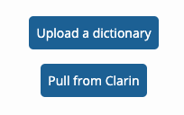
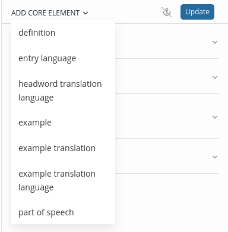
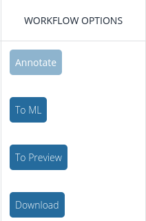
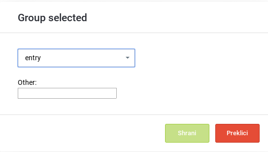

# Elexifier User Guide

Welcome to the *Elexifier User Guide*. Elexifier is an app that allows you to transform XML and PDF dictionaries into an *Elexis Data Model* compliant format. Note that the app is currently in a *Public Beta* release and it is likely that you will encounter bugs and/or unwanted behaviour. For assistance, don't hesitate to contact <elexifier@ijs.si>.

---

# Table of contents

<!-- vscode-markdown-toc -->
* 1. [XML transformation](#XMLtransformation)
	* 1.1. [Upload a new dictionary](#Uploadanewdictionary)
	* 1.2. [Edit transformation](#Edittransformation)
		* 1.2.1. [Overview](#Overview)
		* 1.2.2. [Adding core elements](#Addingcoreelements)
		* 1.2.3. [Editing core elements](#Editingcoreelements)
		* 1.2.4. [Selecting XML elements](#SelectingXMLelements)
		* 1.2.5. [Examples](#Examples)
	* 1.3. [Download transformed dictionary](#Downloadtransformeddictionary)
	* 1.4. [Removing transformations](#Removingtransformations)
	* 1.5. [Reseting transformations](#Resetingtransformations)
	* 1.6. [Deleting dictionaries](#Deletingdictionaries)
	* 1.7. [7. Editing dictionary metadata](#Editingdictionarymetadata)
* 2. [PDF transformation](#PDFtransformation)
	* 2.1. [Sending dictionary to Lexonomy for annotation](#SendingdictionarytoLexonomyforannotation)
	* 2.2. [Annotating dictionary](#Annotatingdictionary)
	* 2.3. [Starting machine learning](#Startingmachinelearning)
	* 2.4. [Previewing results and downloading dictionary](#Previewingresultsanddownloadingdictionary)

<!-- vscode-markdown-toc-config
	numbering=true
	autoSave=true
	/vscode-markdown-toc-config -->
<!-- /vscode-markdown-toc -->

---

# Login
Elexifier is available on [elexifier.elex.is](elexifier.elex.is). You can create a user account or login with your *Sketch Engine* credentials.

**NOTE**: Annotation in Lexonomy is currently **NOT** supported with Sketch Engine credentials. If you want to transform PDF files create a new account in Elexifier.

---

##  1. XML transformation

###  1.1. Upload a new dictionary

Click NEW DICTIONARY in the bottom left corner of the app.

To transform an XML dictionary, on the next screen:
1. Upload your dictionary.
3. Define its metadata.
4. Enter the basic parameters for the transformation:
- ENTRY ELEMENT: the XML element denoting entries (see Elexis Data Model)
- HEADWORD ELEMENT: the XML element denoting headwords (see Elexis Data Model)
- TRANSFORMATION NAME: select a name for your transformation

**Note**: The ENTRY and HEADWORD parameters will be used for the initial segmentation of your dictionary. The current version of Elexifer does not support subsequent re-segmentation according to different values of the ENTRY and HEADWORD parameters. If you want change the segmentation, create a new transformation.

---

###  1.2. Edit transformation

To edit the transformation, click **Edit** in the top row.

---

####  1.2.1. Overview

The Edit Transformation screen consists of:
- A list of entries on the left hand side. 100 entries are displayed by default and you can search for additional entries using the search box.
- The preview pane showing the *Before* and *After* state of the dictionary. You can use the **Strip namespaces** and **Strip dictScrap** checkboxes for easier preview of the transformed dictionary.
- The core element definition pane where you define your transformation.

---

####  1.2.2. Adding core elements

Click ADD CORE ELEMENT at the top and select one, or click an existing core element.

---

####  1.2.3. Editing core elements

To edit a core element:
1. Select an XML element from the list or define a custom path.
2. Optionally, define the **EXCL.** element which will not be included in the transformed dictionary.
2. Select the value to be included in the transformed dictionary:
    - **Element inner text**: extract the inner text of the element
    - **Subtree text**: extract the inner text of the element and all of its descendants
    - **Attribute value**: extract the value of the selected attribute
    - **Constant**: return a constant value instead of extracting the value from the XML
3. Optionally, run regex expressions on the extracted values.
4. Click **Update** to update the transformation.

---

####  1.2.4. Selecting XML elements

Elexifier helps you with the selection of XML elements by validating paths and providing suggestions. Start by selecting one of the XML elements from the list (you can type a few characters to filter the list) and then use the up and down keys to select one of the suggested sub-elements. Confirm selection by pressing the Enter key.

**NOTE:** The elements search is case-sensitive.

####  1.2.5. Examples
This section contains example transformations that ilustrate the various options offered by Elexifier.

---

##### 3.1.2.5.1. A simple transformation
Let's transform a simple XML element `hw` into its Elexis Data Model representation:

    <hw>babble</hw>

Define the HEADWORD element as shown below and press **Update**:

The transformed dictionary looks like this:

    <form type="lemma">
        <orth m:e="hw">babble</orth>
      </form>

---

##### 3.1.2.5.2. Using attribute values in the transformed dictionary
Let's say we want to transform attribute values into Elexis Data Model elements.

    <Lemma writtenForm="X ray" partOfSpeech="n"/>

In the example above, the HEADWORD element can be found in the `writtenFrom` attribute. Start by defining the element containing the attribute to transform (in our case `Lemma`). Then select **Attribute value** in the VALUE field and enter the attribute name (in our case `writtenForm`).

The transformed dictionary looks like this:

    <form type="lemma">
        <orth>X ray</orth>
    </form>

---

##### 3.1.2.5.3. Exclude elements
Let's say we have a `tr` element that can denote a headword translation and an example translation. The transformation needs to take into account where the `tr` element appears in the original XML. We can achieve this by using the **EXCL.** option.

    <tr>žlobudranje; blebetanje, čvekanje, kvasanje; <ic>o otroku</ic>čebljanje;<ic>npr. o potoku</ic>žuborenje, šumenje</tr>
    <e>
      <le>the distant babble of women's voices</le>
      <tr>oddaljeno žensko žlobudranje</tr>
    </e>

If we were to use just the `tr` element in the HEADWORD TRANSLATION core element, the resulting dictionary would not be transformed correctly.

In the example below, the `e/tr` element, which denotes a translation of an example sentence, is also transformed into a headword translation.

    <cit type="translationEquivalent">
        <quote xml:lang="sl">žlobudranje; blebetanje, čvekanje, kvasanje; čebljanje; žuborenje, šumenje</quote>
    </cit>
    <cit type="example">
        <quote>the distant babble of women's voices</quote>
    </cit>
    <cit type="translationEquivalent">
        <quote>oddaljeno žensko žlobudranje</quote>
    </cit>

By defining the **EXCL.** parameter, we can prevent the `e/tr` element from being incorrectly transformed into HEADWORD TRANSLATION.

In the EXAMPLE TRANSLATION core element, we can then define the correct path for the example translation:

This results in the correct transformation:

    <cit type="translationEquivalent">
        <quote xml:lang="sl">žlobudranje; blebetanje, čvekanje, kvasanje; čebljanje; žuborenje, šumenje</quote>
    </cit>
    <cit type="example">
        <quote>the distant babble of women's voices</quote>
    </cit>
    <cit type="translation">
        <quote xml:lang="sl">oddaljeno žensko žlobudranje</quote>
    </cit>

---

##### 3.1.2.5.4. Join elements

You can transform multiple XML elements have into one Elexis Data Model core element. The following dictionary uses `s1` and `s2` to denote senses:

    <s1>
        <hg st="3">
        <ps>sam.</ps>
        </hg>
        <tr>blejanje, beketanje</tr>
    </s1>
    <s1>
        <hg st="4">
        <ps>nepreh. glag.</ps>
        </hg>
        <s2>
        <tr>blejati, beketati</tr>
        </s2>

Define the SENSE core element as follows:

Both elements are transformed as senses:

    <sense xml:id="sense_2">
        <gramGrp>
        <gram type="pos">noun</gram>
        </gramGrp>
        <cit type="translationEquivalent">
        <quote xml:lang="sl">blejanje, beketanje</quote>
        </cit>
    </sense>
    <sense xml:id="sense_3">
        <gramGrp>
        <gram type="pos">nepreh. glag.</gram>
        </gramGrp>
        <sense xml:id="sense_4">
        <cit type="translationEquivalent">
            <quote xml:lang="sl">blejati, beketati</quote>
        </cit>
        </sense>

---

##### 3.1.2.5.5. Add translation language
To add a `lang` attribute to an element, the **Entry**, **Headword Translation** and **Example Translation** have a dedicated **Language** field where you can select and ISO 639-2 language code. Simply start typing and then select a value from the list.

The resulting dictionary looks like this (note the `xml:lang` attribute):

    <cit type="translationEquivalent">
        <quote xml:lang="slv">blejanje, beketanje</quote>
        </cit>

---

##### 3.1.2.5.6. Edit part-of-speech core element

The part-of-speech core element is unique among core elements, because you have to specify an additional mapping table for each value found in the part-of-speech element of the original XML file. In the example below, the `ps` element contains the POS information.

    <ps>sam.</ps>

Start by defining the original XML file part-of-speech element and its value as usual.

Click the arrow next to POS and select a value from from the list.

On the right-hand side, select a corresponding Universal Dependency tag.

The transformed dictionary looks like this:

    <gramGrp>
        <gram type="pos">noun</gram>
    </gramGrp>

---

###  1.3. Download transformed dictionary

To download the transformed dictionary, click the **Download** button in the top row.

In the window that opens, you can select to download the dictionary:
- **With namespaces**, which keeps the information on the original xml elements
- **Without namespaces**, which discards the information on the original xml elements

The processing starts in the background. Once it is done, you will see a **Download** button which you can use to download the transformed dictionary.

---

###  1.4. Removing transformations

Click **Remove** in the top row.

---

###  1.5. Reseting transformations

Click **Reset** in the top row.

---

###  1.6. Deleting dictionaries

Click the three dots next to the dictionary name and then click **Delete dictionary**. This will delete the dictionary and all its transformations.

###  1.7. Editing dictionary metadata

Click the three dots next to the dictionary name and then click **Edit metadata**. You can edit the metadata in the popup window.

##  2. PDF transformation

PDF transformation combines human annotation with machine learning to rapidly convert large PDF dictionaries. Users start by annotating a sample of the data in Lexonomy and then Elexifier propagates the annotations to the entire dictionary.

Tips for best results:
- We suggest you delete any pages that do not contain dictionary data, such as title pages, introductions, tables of contents etc. While it won't stop Elexifier from processing your file, it may have an adverse effect the final results.
- The algorithm uses information about font size, font type, position etc. to learn the annotations. As such, it works best on dictionaries that consistently use different fonts for different elements (headwords, examples, part-of-speech tags etc.).
- While the algorithms work well in general, don't expect perfect results, even in the best of cases, a small number of mistakes may need to be manually corrected.
- Machine learning needs a large enough sample of annotated data. Annotate **at least** four (4) pages of the original XML. Smaller samples may still work, but they are more prone to errors. If you annotated at least 4 pages and still encounter errors or the results are not satisfactory, contact <elexifier@ijs.si>.
- Note that this is a public beta release and you are likely to encounter bugs and/or unexpected behaviour.

###  2.1. Sending dictionary to Lexonomy for annotation

After uploading a dictionary, click Annotate and wait while the PDF dictionary is converted and sent to Lexonomy (lexonomy.elex.is).

Click the link that appears and login to Lexonomy. You will need to create an account with the same email address in Lexonomy in order to annotate the file. By default, Elexifier sends the first 20 pages. In rare cases where you need to annotate more than 20 pages, you can use the **+** sign to send another batch of 20 pages to Lexonomy. Once the file is sent to Lexonomy, you can use the **Reset annotations** button to delete all existing annotations and start over.

###  2.2. Annotating dictionary

Select your data (i.e. *pages 1-20* below) from the list in Lexonomy and open it for editing.

Annotate the following elements: `entry`, `headword`, `part of speech`, `sense`, `definition`, `translation`, `example`. Using the mouse, highlight the words that form an individual element and then double-click to select an annotation label from the list.

The annotations will be visible in the preview window. Lexonomy implements a few basic rules to limit the range of possible annotations. A valid entry will have a **green** rectangle, while an invalid entry will have an **orange** rectangle. When you save the annotations (using the **Save** button in the top toolbar), Lexonomy will warn you if your data contains invalid entries.

**IMPORTANT**: Save your work on a regular basis to avoid losing your annotations!

###  2.3. Starting machine learning

After you finish the annotation, go back to Elexifier and click the **To ML** button to run the training and predicition processes. Depending on the size of the dictionary, it may take a few hours. You can safely close the window in the meantime. Once the process is completed, Elexifier will display a status message informing you about the results.

###  2.4. Previewing results and downloading dictionary

You can check the results of the prediction process in Lexonomy. After ML is finished, click the **To Preview** butoon to send the file back to Lexonomy and have a look at the results. If you are happy with the results, click **Download** in Elexifier to download a TEI-compliant XML file of the converted dictionary. 

Due to various types of PDF file encodings, the initial PDF conversion can contain corrupted characters. If this is the case in your data, you can map corrupted characters to proper ones using the **Map characters** button. 